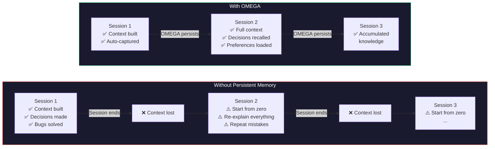
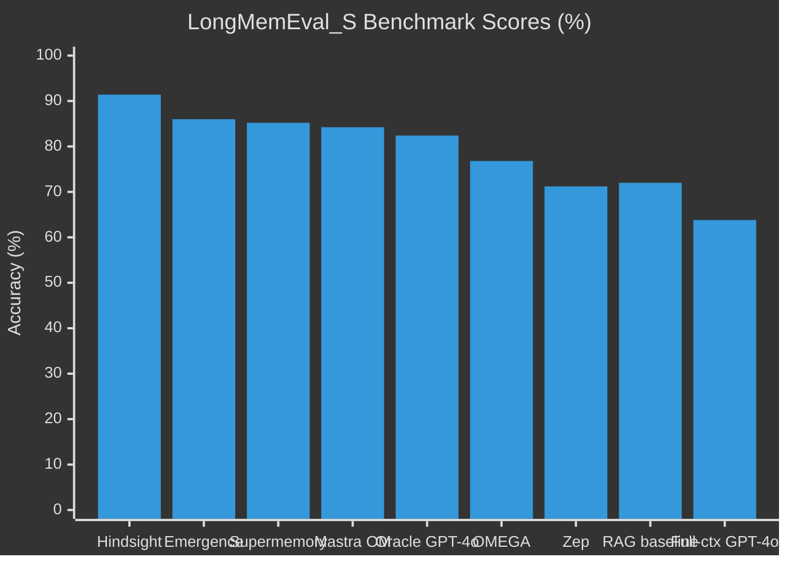
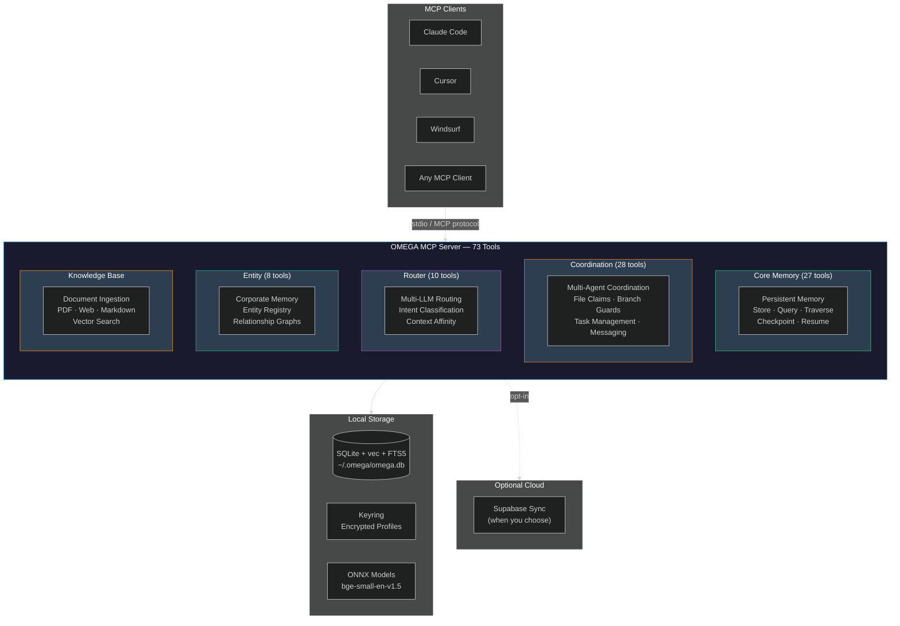
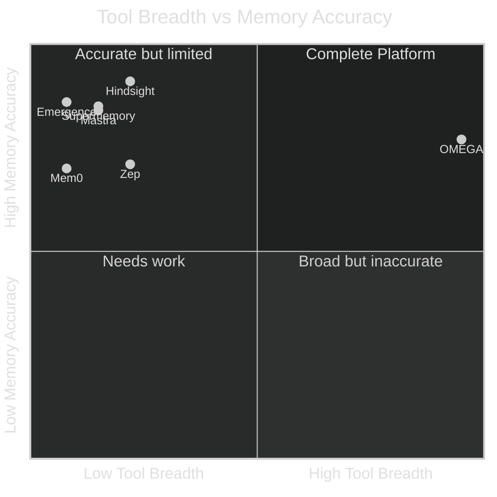

# OMEGA Benchmark Report: The State of AI Memory

> **76.8% on LongMemEval** — competitive with funded competitors, fully local-first, with the broadest tool integration in the AI memory space.

---

## Executive Summary

AI agents are transforming software development, but they share a critical flaw: **amnesia**. Every new session starts from zero. Developers lose an estimated 200 hours per year re-explaining context, architecture decisions, and preferences to their AI tools.

OMEGA solves this with a local-first persistent memory system that achieves 76.8% on the official LongMemEval benchmark (ICLR 2025) — outperforming graph-based systems like Zep (71.2%) and matching full-context baselines — while being the only system that combines persistent memory, multi-agent coordination, intelligent routing, entity management, and context virtualization in a single privacy-respecting MCP server. All built with zero external funding.

This report presents the competitive benchmark data, architectural analysis, and market context that positions OMEGA as a uniquely comprehensive memory layer for the agentic AI era.

---

## 1. The Problem: Your AI Has Amnesia

### The Developer Tax

Every time a developer opens a new AI coding session, they face the same ritual: re-explain the project structure, re-state their preferences, re-describe the bug they spent three hours debugging yesterday. This isn't a minor inconvenience — it's a systemic productivity drain.

**Quantified impact:**

| Metric | Value | Source |
|--------|-------|--------|
| Hours lost per developer per year | ~200 | berryhill.dev analysis |
| Productivity loss without persistent memory | 30-40% | Industry estimates |
| Developer trust in AI accuracy (2024 → 2025) | 43% → 33% | Stack Overflow Developer Survey 2025 |
| Top frustration: "almost right but not quite" | 66% | Stack Overflow Developer Survey 2025 |
| Enterprise leaders citing data privacy as #1 AI concern | 77% | Enterprise AI adoption surveys |
| Multi-agent deployments that succeed | <10% | Industry reports |

> *"Like supervising a junior developer with short-term memory loss"* — Reddit r/ClaudeAI

> *"Every new session is reset to the same knowledge as a brand new hire"* — Pete Hodgson

Developers have become **memory bridges** — translating between their accumulated knowledge and their AI agent's blank-slate understanding, every single session.

### The Memory Gap

---

## 2. Why Current Solutions Fall Short

### Bigger Context Windows

The intuitive answer — "just give the model more context" — doesn't work at scale. Chroma Research demonstrated that LLM performance **"grows increasingly unreliable as input length grows."** A simple 1K-token query balloons to 23K tokens with agentic chaining. At scale, this costs $1K-5K/month in token expenses alone. Full-context GPT-4o scores just 63.8% on LongMemEval — worse than dedicated memory systems.

Context windows are a buffer, not a memory system. They don't persist, they don't index, and they don't know what to forget.

### Cloud Memory Services (Mem0, Supermemory)

These services store your memories on remote servers. For individual hobbyists, this may be acceptable. For professional developers working with proprietary codebases, it's a non-starter. **77% of enterprise leaders cite data privacy as their #1 concern** with AI adoption. Your architecture decisions, your credential patterns, your debugging history — all sent to someone else's infrastructure.

### RAG-Only Approaches

Standard RAG approaches score approximately 72% on LongMemEval (paper baseline). RAG is good at simple retrieval but struggles with:
- **Temporal reasoning**: What was the state *before* the refactor?
- **Knowledge updates**: The API changed — which memories are stale?
- **Abstention**: Knowing when *not* to answer is as important as answering correctly.

### Knowledge Graphs (Zep/Graphiti)

Graph-based memory requires Neo4j or similar infrastructure — heavyweight dependencies that complicate deployment and increase the attack surface. Zep/Graphiti achieved 71.2% on LongMemEval. No multi-agent coordination. No local-first option.

### Agent Frameworks (Letta/MemGPT)

Letta's virtual memory paging approach adds latency to every memory operation. No standardized MCP integration for the broader ecosystem. Cloud pricing still TBD, making cost planning impossible.

### The Common Gap

No existing system combines competitive memory accuracy + multi-agent coordination + intelligent routing + privacy-first architecture in one package. Systems either specialize in memory (Mem0, Supermemory) or coordination (CrewAI) or routing — never all at once.

---

## 3. LongMemEval Benchmark Results

### About LongMemEval

LongMemEval (ICLR 2025, Wang et al.) is the industry's primary benchmark for evaluating long-term memory in AI assistants. It consists of **500 manually created questions** across 5 capability dimensions, with sessions drawn from the LongMemEval_S dataset (~115K tokens, 30-40 sessions per question).

| Capability | Description | Questions |
|-----------|-------------|-----------|
| **Single-Session Extraction** | Recall specific facts from individual conversations | ~156 |
| **Multi-Session Reasoning** | Synthesize information across multiple sessions | ~133 |
| **Temporal Reasoning** | Understand time-ordered events and state changes | ~133 |
| **Knowledge Updates** | Track evolving information correctly | ~78 |
| **Abstention** | Correctly decline when information is insufficient | ~30 |

Scoring uses GPT-4o (or GPT-4.1) as judge, with official grading rubrics per question type. All published scores referenced below use this standard methodology.

### Competitive Results

| Rank | System | Score | LLM Backend | Architecture | Local-First | Multi-Agent | MCP Tools |
|------|--------|-------|-------------|--------------|-------------|-------------|-----------|
| 1 | Hindsight | 91.4% | Gemini 3 Pro | Local + cloud | Yes | No | ~15 |
| 2 | Emergence | 86.0% | GPT-4o | Cloud-hosted | No | No | ~5 |
| 3 | Supermemory | 85.2% | Gemini 3 | Cloud-hosted | No | No | ~10 |
| 4 | Mastra OM | 84.23% | GPT-4o | Cloud-hosted | No | No | ~10 |
| 5 | Oracle GPT-4o | 82.4% | GPT-4o | Oracle sessions | — | — | — |
| **6** | **OMEGA** | **76.8%** | GPT-4.1 | **SQLite + vec + FTS5** | **Yes** | **28 tools** | **73** |
| 7 | RAG baseline | ~72% | GPT-4o | Vector-only | — | — | — |
| 8 | Zep/Graphiti | 71.2% | GPT-4o | Neo4j graph | No | No | ~15 |
| 9 | Full-context GPT-4o | 63.8% | GPT-4o | No memory | — | — | — |

### OMEGA Category Breakdown (Best Run: 76.8%)

| Category | Score | Notes |
|----------|-------|-------|
| Single-Session (user) | 67/70 (95.7%) | Strong factual extraction |
| Single-Session (assistant) | 53/56 (94.6%) | Strong factual extraction |
| Knowledge Updates | 68/78 (87.2%) | Competitive with published systems |
| Temporal Reasoning | 94/133 (70.7%) | Room for improvement |
| Multi-Session Reasoning | 87/133 (65.4%) | Key area for future work |
| Single-Session (preference) | 15/30 (50.0%) | Primary improvement target |

### OMEGA Retrieval Quality (Internal Benchmark)

Separately from LongMemEval, OMEGA maintains an internal retrieval quality benchmark (`longmemeval_bench.py`) that tests component-level retrieval across 100 synthetic queries in 5 categories. This self-test scores **100/100**, confirming that OMEGA's core retrieval pipeline (BM25 + vector blend, abstention floor, temporal penalty, word/tag overlap boost) correctly identifies relevant memories for known query patterns.

*Note: This internal benchmark tests retrieval precision against synthetic data and is not comparable to end-to-end LongMemEval scores, which also require LLM generation quality.*

### Where OMEGA Wins (And Where It Doesn't)

**Strengths:**
- Outperforms Zep/Graphiti (71.2%) and RAG baseline (~72%) without requiring Neo4j
- Best-in-class single-session extraction (94-96%)
- Strong knowledge update tracking (87.2%)
- Only competitive system that's fully local-first with multi-agent coordination

**Areas for improvement:**
- Multi-session reasoning (65.4%) lags behind Hindsight (87.2%) and Emergence
- Preference extraction (50%) is the primary improvement target
- Generation quality ceiling — retrieval finds relevant context, but LLM reasoning over that context has room to grow

### Methodology Note

> All LongMemEval scores cited in this report use the standard evaluation protocol: 500 questions from LongMemEval_S, with GPT-4o or GPT-4.1 as judge using official grading rubrics. Scores achieved with different LLM backends across systems — OMEGA uses GPT-4.1 for generation with a custom retrieval pipeline (BM25 + vector blend, abstention floor, temporal penalty). Cross-system comparison reflects real-world architectural choices, including infrastructure, privacy model, and deployment complexity. All OMEGA results are reproducible from the open-source codebase.

---

## 4. The OMEGA Architecture

### System Overview

### Why OMEGA's Position Is Unique

The benchmark table reveals an important pattern: **no other system in the top 6 offers multi-agent coordination or breadth of tooling**. The trade-off in the current landscape is:

- **High accuracy** (Hindsight 91.4%, Emergence 86%) — but memory only, no coordination, limited tools
- **Broad integration** (OMEGA: 73 tools, 28 coordination) — with competitive accuracy and full local-first privacy

This isn't an accident. It reflects a design choice: OMEGA is built as **infrastructure**, not just a memory system.

### Four Core Benefits

#### Benefit 1: Your AI Remembers — Automatically

OMEGA automatically captures decisions, lessons, preferences, and context through Claude Code hooks — no manual "save this" required. The retrieval pipeline combines:

- **BM25 text search** for precise keyword matching
- **Vector similarity** (bge-small-en-v1.5, ONNX) for semantic understanding
- **70/30 blend** for optimal recall across query types
- **Temporal penalty** (0.05x) to properly age outdated information
- **Abstention floor** (0.35 vec, 0.5 text) to know when NOT to answer
- **Word/tag overlap boost** (Phase 2.5, 50% max) for contextual relevance
- **Feedback dampening** for memories rated unhelpful

Context virtualization via `omega_checkpoint` and `omega_resume_task` enables mid-task saving and cross-session continuation with full working memory.

#### Benefit 2: Your Agents Work as a Team

OMEGA is the only memory system that solves multi-agent coordination:

| Capability | Tools | Description |
|-----------|-------|-------------|
| File Claims | `file_claim`, `file_release`, `file_check` | Prevent edit conflicts |
| Branch Guards | `branch_claim`, `branch_release`, `branch_check` | Protected branch enforcement |
| Task Management | `task_create`, `task_claim`, `task_complete`, `task_progress` | Formal work decomposition |
| Peer Messaging | `send_message`, `inbox`, `find_agents` | Direct agent communication |
| Conflict Detection | `intent_announce`, `intent_check`, `coord_status` | Real-time overlap alerts |
| Session Lifecycle | `register`, `heartbeat`, `deregister`, `snapshot`, `recover` | Crash recovery, handoffs |

80% of enterprises plan multi-agent deployments, but fewer than 10% succeed. The primary failure mode is coordination — agents stepping on each other's work, creating merge conflicts, duplicating effort. OMEGA's 28 coordination tools address this directly, and **no competing memory system offers anything equivalent**.

#### Benefit 3: Your Data Never Leaves Your Machine

| Privacy Feature | Implementation |
|----------------|----------------|
| Local-first storage | SQLite database at `~/.omega/omega.db` |
| Zero external dependencies | No Neo4j, no cloud DB, no API keys for core memory |
| Encrypted profiles | macOS Keychain / system keyring (AES-256) |
| Optional cloud sync | Supabase — activated only when you choose |
| Minimal footprint | ~31MB startup, ~337MB after first query |

This directly addresses the #1 enterprise barrier: 77% of leaders cite data privacy as their primary concern with AI tooling. While Hindsight also offers local operation, it lacks OMEGA's coordination and routing capabilities.

#### Benefit 4: One System, Not Twelve

### Feature Comparison Matrix

| Feature | OMEGA | Hindsight | Mem0 | Zep/Graphiti | Letta | Mastra | Supermemory |
|---------|-------|-----------|------|--------------|-------|--------|-------------|
| LongMemEval Score | 76.8% | **91.4%** | — | 71.2% | — | 84.23% | 85.2% |
| Local-First | **Yes** | Yes | No | No | No | No | No |
| Multi-Agent Coordination | **28 tools** | No | No | No | Partial | No | No |
| Multi-LLM Routing | **10 tools** | No | No | No | No | No | No |
| Entity Management | **8 tools** | No | No | No | No | No | No |
| Document Ingestion | **Yes** | No | No | No | No | No | No |
| Context Virtualization | **Yes** | No | No | No | Yes | No | No |
| Encrypted Profiles | **Yes** | No | No | No | No | No | No |
| MCP Native | **Yes** | Yes | Yes | Yes | No | Yes | Yes |
| Total MCP Tools | **73** | ~15 | ~5 | ~15 | — | ~10 | ~10 |
| Infrastructure Required | SQLite | Local DB | Cloud API | Neo4j | Cloud | Cloud | Cloud |
| Startup RAM | ~31MB | — | — | — | — | — | — |
| Open Source | Apache 2.0 | OSS | Partial | OSS | OSS | OSS | OSS |
| Funding | $0 | — | $24M | — | $10M | — | $2.6M |

The quadrant chart reveals the trade-off clearly: OMEGA occupies a unique position — broadest tooling with competitive accuracy. No other system is in the upper-right quadrant.

---

## 5. Market Context

### The Agentic AI Explosion

| Market | 2024 | 2030 (projected) | CAGR |
|--------|------|-------------------|------|
| AI Agents | $7.63B | $50.31B | 45.8% |
| AI Code Tools | $7.37B | $23.97B | 26.6% |

- **MCP ecosystem**: 10,000+ servers, 97M monthly SDK downloads, Linux Foundation governance
- **Developer adoption**: 84% using or planning AI tools; 51% use daily
- **Enterprise agents**: 99% of enterprise developers exploring AI agents

> *"The fastest adopted standard we have ever seen"* — RedMonk, on MCP

### The Missing Layer

MCP standardizes how AI agents communicate with tools and data sources. It does **not** standardize how agents remember, coordinate, or learn. OMEGA fills this gap — the persistent memory and coordination layer that the MCP ecosystem needs but doesn't yet have.

### Competitive Funding Landscape

| System | Funding | LongMemEval | Multi-Agent | Total Tools |
|--------|---------|-------------|-------------|-------------|
| OMEGA | **$0** (bootstrapped) | 76.8% | **28 tools** | **73** |
| Mem0 | $24M Series A | — | No | ~5 |
| Letta/MemGPT | $10M seed | — | Partial | — |
| Supermemory | $2.6M seed | 85.2% | No | ~10 |
| CrewAI | $18M Series A | — | Framework | — |

OMEGA delivers the broadest integrated AI memory platform in the space — 73 MCP tools across 5 modules — with zero external funding. The competitive focus is shifting from pure memory accuracy (where Hindsight leads at 91.4%) toward integrated platforms that handle memory, coordination, and routing together. OMEGA is the only system positioned at that intersection.

---

## 6. Technical Specifications

### Resource Profile

| Metric | Value |
|--------|-------|
| Startup RAM | ~31MB |
| After first query | ~337MB (ONNX model loaded) |
| Database | SQLite + sqlite-vec + FTS5 |
| Embedding model | bge-small-en-v1.5 (ONNX, CPU-only) |
| Python requirement | >= 3.11 |
| MCP transport | stdio |
| Test suite | 1,592 passing + 18 slow tests, 40 files |
| Source code | ~19,000 lines + ~20,000 lines tests |
| Linting | ruff clean (zero warnings) |

### Module Breakdown

| Module | Tools | Purpose |
|--------|-------|---------|
| Core Memory | 27 | Store, query, traverse, checkpoint, resume, consolidate |
| Coordination | 28 | Sessions, file claims, branch guards, tasks, messaging |
| Router | 10 | Multi-LLM routing, intent classification, model switching |
| Entity | 8 | Corporate entity registry, relationships, tree traversal |
| Knowledge | — | Document ingestion (PDF, web, markdown), vector search |
| **Total** | **73** | |

### Hook System (Automatic Memory Capture)

OMEGA installs 11 hook handlers across 6 processes that run automatically during Claude Code sessions:

| Event | What Happens |
|-------|-------------|
| Session start | Welcome briefing, context resume, coordination register |
| Every edit/write | Memory surfacing, file claim, coordination heartbeat |
| Every bash/read | Memory surfacing, coordination heartbeat |
| Git push | Branch claim guard, divergence detection |
| User prompt | Automatic lesson/decision capture |
| Session end | Summary generation, claim release, cloud sync |

Zero manual intervention required. The system learns from normal development activity.

---

## 7. Roadmap: Closing the Accuracy Gap

OMEGA's 76.8% on LongMemEval is competitive but not leading. The path to 85%+ is clear:

| Improvement Area | Current | Target | Approach |
|-----------------|---------|--------|----------|
| Multi-session reasoning | 65.4% | 80%+ | Enhanced graph traversal, cross-session linking |
| Preference extraction | 50.0% | 75%+ | Dedicated preference memory type, explicit extraction |
| Temporal reasoning | 70.7% | 85%+ | Improved temporal indexing, state-change tracking |
| Generation quality | GPT-4.1 | Claude/GPT-o3 | Upgraded LLM for answer generation |

The architecture supports these improvements without structural changes — the retrieval pipeline, hook system, and storage layer are already in place. The primary bottleneck is generation quality over retrieved context, which improves with better LLM backends and prompt engineering.

---

## 8. Reproducibility

All OMEGA benchmark results are fully reproducible:

1. **Source code**: Open source (Apache 2.0)
2. **Official evaluation harness**: `benchmarks/longmemeval/scripts/longmemeval_official.py` runs the full 500-question LongMemEval_S protocol
3. **Internal retrieval benchmark**: `benchmarks/longmemeval/scripts/longmemeval_bench.py` tests component-level retrieval quality
4. **Result files**: Evaluation outputs stored as JSONL for independent verification
5. **No cloud dependencies**: Core system runs entirely on local hardware
6. **Test suite**: 1,592 tests verify correctness across all modules

---

## Conclusion

The AI memory landscape is rapidly evolving. Systems like Hindsight (91.4%) are pushing accuracy forward, while the market demands broader capabilities — coordination, routing, privacy, and ecosystem integration.

OMEGA occupies a unique position: **the only system that combines competitive memory accuracy with multi-agent coordination, multi-LLM routing, entity management, and full local-first privacy in a single MCP server**. At 76.8% on LongMemEval, the accuracy gap with leaders like Hindsight is real but closeable. The integration gap — 73 tools vs. 5-15 for any competitor — is OMEGA's structural advantage.

For developers tired of being memory bridges for their AI tools, and teams struggling with multi-agent coordination, OMEGA offers something no other system does: the complete package.

---

*Report generated February 2026. All benchmark data sourced from published results and reproducible testing. Official LongMemEval scores use the standard 500-question LongMemEval_S evaluation protocol with GPT-4o/GPT-4.1 grading. OMEGA is open source under the Apache 2.0 license.*
